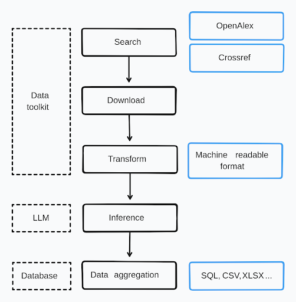

# EcoOpen Data Detection Tool

Sharing open data alongside publications is becoming increasingly common in ecology and evolutionary biology, with datasets typically shared via repositories or as supplementary materials. Despite this progress, the use of shared data remains limited. One barrier is the difficulty of manually detecting data sharing, which is often inconsistently reported or requires significant effort to access and download. Additionally, researchers, funders, and publishers may wish to automate the assessment of data-sharing rates and evaluate adherence to best practices.

EcoOpen Data Detection Tool is an open-source tool that allows users to search for ecological data in scientific papers. The tool is developed with support by the Croatian Science Foundation (HRZZ) under the project number IP-2022-10-2872.


EcoOpen Data Tool can be extended to other scientific domains and data types and is also designed for integration with LLM based knowledge collection and data extraction tools.



Although the main functionality of the tools is the detection of open data in scientific papers, the tool contains additional functionalities such as:

- Search for articles in OpenAlex
- Download full text of articles *if available*
- Extract text from articles
- Find open data in articles
- Extract data from articles
- Extract metadata from articles
- Download data from repositories *if available*

## Installation

```bash
pip install ecoopen
```

# Dev-roadmap
- [x] Search for articles in Crossref
- [x] Download full text of articles
- [x] Extract text from articles
- [x]Find open data in articles

# 

## Usage

The package is designed to be easy to use:


```Python
from ecoopen.core import *
#1. Search for papers
papers = search_papers("ecology", 10)
#2. Download papers
papers_download = download_papers(papers)
#3. Extract data
data = extract_data(papers_download)
#4. Download data
data_download = download_data(data)

```

With every step, you can see the progress of the tool and the results of the search, download, extraction, and download of data. The variables `papers`, `papers_download`, `data`, and `data_download` are `pandas` dataframes that contain the results of the search, download, extraction, and download of data, respectively.

## Contributing

We welcome contributions to the EcoOpen Data Detection Tool. Please use the following guidelines:

- Fork the repository
- Create a new branch
- Make your changes
- Test your changes
- Create a pull request
- Wait for the review

Feel free to join discussions on the issues page.

